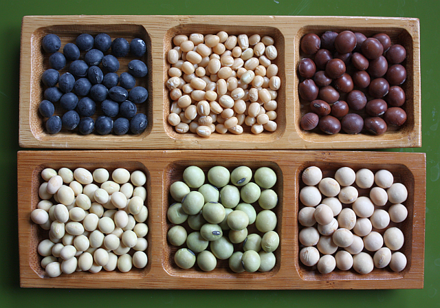

# 🫘 Support Vector Classifier for Soybean Classification

## Support Vector Machines

*In machine learning, support vector machines (SVMs, also support vector networks) are supervised learning models
with associated learning algorithms that analyze data for classification and regression analysis. Developed at AT&T Bell
Laboratories by Vladimir Vapnik with colleagues, SVMs are one of the most robust prediction methods, being based on
statistical learning frameworks or VC theory proposed by Vapnik (1982, 1995) and Chervonenkis (1974). Given a set of
training examples, each marked as belonging to one of two categories, an SVM training algorithm builds a model that
assigns new examples to one category or the other, making it a non-probabilistic binary linear classifier (although
methods such as Platt scaling exist to use SVM in a probabilistic classification setting). SVM maps training examples to
points in space so as to maximise the width of the gap between the two categories. New examples are then mapped into
that same space and predicted to belong to a category based on which side of the gap they fall.*

## Types of Soybeans and Class Distribution

Class Distribution of soybeans:

1. diaporthe-stem-canker: 10
2. charcoal-rot: 10
3. rhizoctonia-root-rot: 10
4. phytophthora-rot: 40
5. brown-stem-rot: 20
6. powdery-mildew: 10
7. downy-mildew: 10
8. brown-spot: 40
9. bacterial-blight: 10
10. bacterial-pustule: 10
11. purple-seed-stain: 10
12. anthracnose: 20
13. phyllosticta-leaf-spot: 10
14. alternarialeaf-spot: 40
15. frog-eye-leaf-spot: 40
16. diaporthe-pod-&-stem-blight: 6
17. cyst-nematode: 6
18. 2-4-d-injury: 1
19. herbicide-injury: 4

## Results

                precision    recall  f1-score   support

           0       0.93      0.80      0.86        51
           1       1.00      0.83      0.91        24
           2       0.00      0.00      0.00        10
           3       0.00      0.00      0.00        10
           4       0.39      0.98      0.56        52
           5       0.94      0.71      0.81        24
           6       1.00      1.00      1.00        10
           7       1.00      1.00      1.00        10
           8       1.00      0.40      0.57        10
           9       0.95      0.73      0.82        51
          10       0.00      0.00      0.00        10
          11       1.00      1.00      1.00         4
          12       0.00      0.00      0.00        10
          13       1.00      0.70      0.82        10
          14       1.00      1.00      1.00        10

    accuracy                            0.71       296
    macro avg       0.68      0.61      0.62       296
    weighted avg    0.73      0.71      0.69       296
